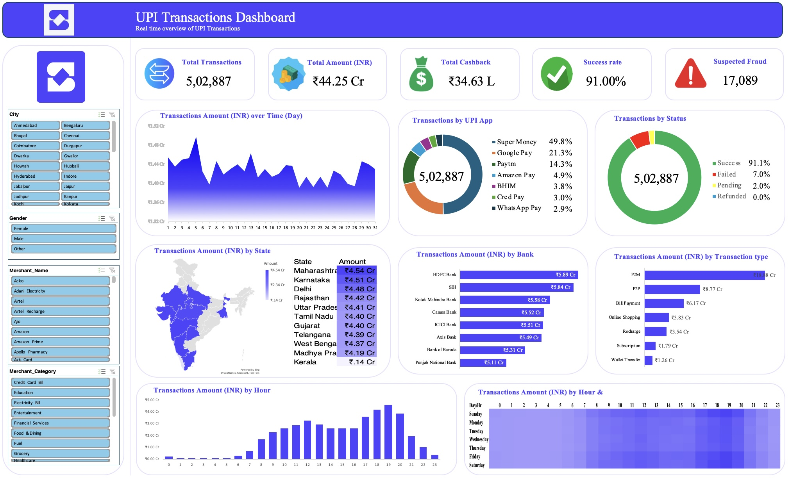

# UPI Transactions Dashboard

An interactive Excel dashboard analyzing 500,000+ Indian UPI (Unified Payments Interface) transaction records, built to surface transaction trends, success/failure patterns, and regional payment behavior across states, banks, and merchant categories.

## Overview

This project transforms a large raw UPI transactions dataset into a decision-ready analytics dashboard using native Excel tools — PivotTables, PivotCharts, and interactive slicers — without relying on external BI software. The goal was to demonstrate that meaningful, stakeholder-ready analysis doesn't require heavyweight tools when the fundamentals (data structuring, KPI design, and visual storytelling) are done well.

## Dataset

- **Size:** 5,02,000+ transaction records
- **Scope:** UPI transactions across Indian states, banks, and merchant categories
- **Fields include:** transaction amount, status (success/failed), UPI app, bank, state, merchant category, gender, transaction date/time, cashback

## Key Features

**5 KPI Indicators**
- Total Transactions
- Total Transaction Amount
- Success Rate
- Failed Transactions
- Total Cashback Issued

**3 Interactive Slicers**
- Gender
- Region
- Merchant Category

Slicers allow dynamic, real-time filtering across every chart and KPI card simultaneously, enabling audience-specific views (e.g., filtering to a single region or merchant category on demand).

**Visualizations Across 7+ Dimensions**
- Transaction volume over time
- Transactions by UPI app
- Transaction status breakdown (success vs. failed)
- Transactions by state (state-wise map visualization)
- Transactions by bank
- Transactions by hour of day
- Heat map of transaction intensity

Chart types used: PivotCharts, bar graphs, state maps, and heat maps.

## Tools & Techniques

- **Microsoft Excel** — core platform
- **PivotTables** — data structuring, aggregation, and summarization of the raw dataset
- **PivotCharts** — dynamic visualizations linked to PivotTable data
- **Slicers** — interactive, cross-filtering controls
- **Data Cleaning** — handling missing values, standardizing categorical fields, formatting date/time fields for time-based analysis

## Key Insights

- Identified peak transaction hours and days across the dataset
- Surfaced state-wise and bank-wise success/failure trends, highlighting regions with disproportionately higher failure rates
- Compared UPI app usage patterns across merchant categories and regions

## Files in This Repository

- `UPI_Transactions_Dashboard.xlsx` — the full interactive dashboard
- `README.md` — this file

## How to Use

1. Download `UPI_Transactions_Dashboard.xlsx`
2. Open in Microsoft Excel (2016 or later recommended for full PivotTable/Slicer support)
3. Use the slicers on the dashboard sheet to filter by gender, region, or merchant category
4. All KPI cards and charts update dynamically based on slicer selection

## Author

**Nivas P**
[LinkedIn](https://linkedin.com/in/nivas-pownraj-dev1707/) · [GitHub](https://github.com/Nivas1707) · [Portfolio](https://nivas17-portfolio.netlify.app/)
